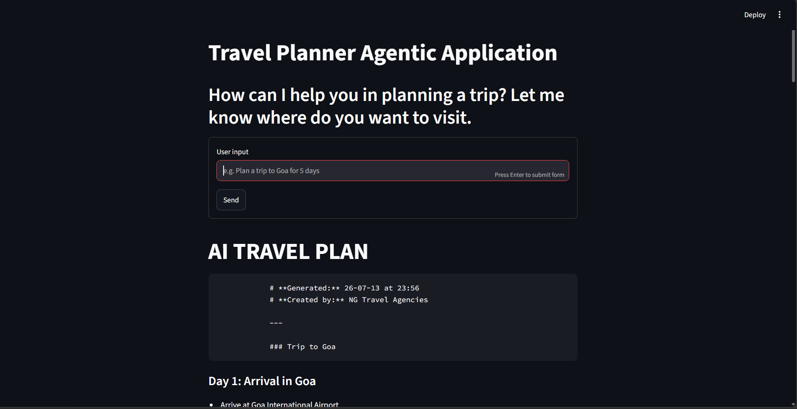
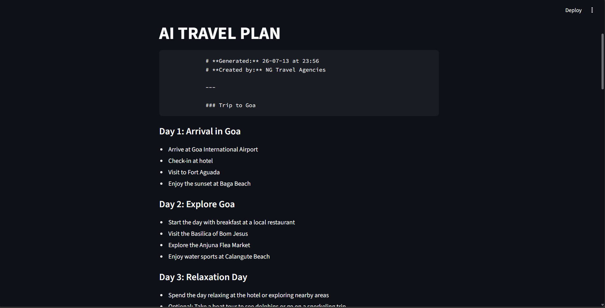
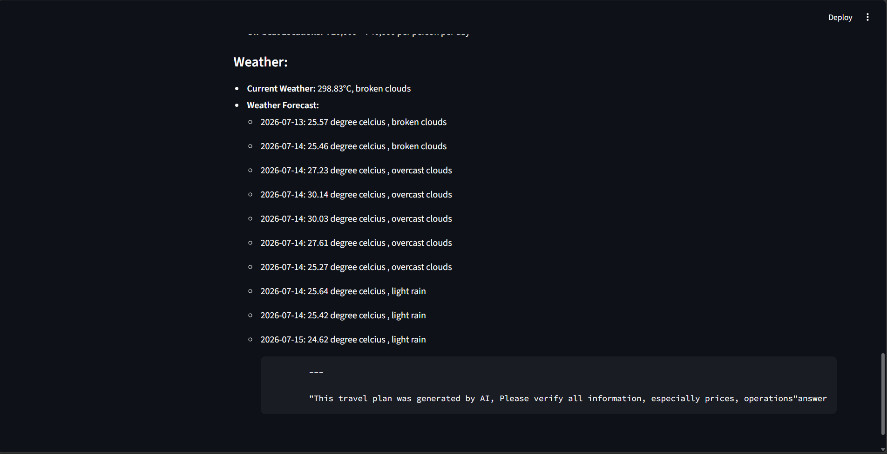

# ✈️ AI Trip Planner

An AI-powered travel planning assistant built with **LangGraph, LangChain, FastAPI, and Groq LLM**.  
The agent can generate personalized travel itineraries, search destinations, check weather, calculate expenses, estimate hotel costs, and provide trip budgets using multiple tools.

---

## 🚀 Features

### 🤖 AI Travel Agent
- Built using **LangGraph agent architecture**
- Uses LLM reasoning to decide when to call tools
- Maintains conversation state using LangGraph `MessagesState`
- Supports multi-step tool execution

### 🛠️ Integrated Tools

#### 🌦️ Weather Information
- Fetches current weather
- Provides weather forecast for destinations
- Uses OpenWeather API

#### 📍 Place Search
- Finds tourist attractions
- Provides destination recommendations

#### 💰 Expense Calculator
- Calculates:
  - Total trip expenses
  - Hotel costs
  - Daily travel budget

#### 💱 Currency Conversion
- Converts currency values for international travel planning

---
# 📸 Project Screenshots

## 🖥️ Application Preview

### Image 1


### Image 2


### Image 3



---

# ⚙️ Installation

## 1. Clone Repository

```bash
git clone https://github.com/<your-username>/AI_Trip_Planner.git

cd AI_Trip_Planner


python -m venv env
env\Scripts\activate
pip install -r requirements.txt
---

## env file
GROQ_API_KEY = "YOUR_GROQ_API_KEY"
GOOGLE_API_KEY = "YOUR_GOOGLE_API_KEY"
GPLACE_API_KEY = "YOUR_GPLACE_API_KEY"
FOURSQUARE_API_KEY = "YOUR_FOURSQUARE_API_KEY"
TAVILAY_API_KEY = "YOUR_TAVILAY_API_KEY"
OPENWEATHERMAP_API_KEY = "YOUR_OPENWEATHERMAP_API_KEY"
EXCHANGE_RATES_API_KEY = "YOUR_EXCHANGE_RATES_API_KEY"


uvicorn main:app --host 0.0.0.0 --port 8000 --reload
streamlit run streamlit_app.py